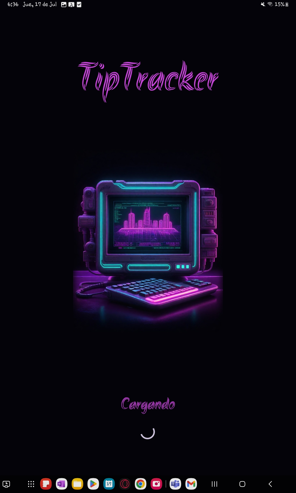
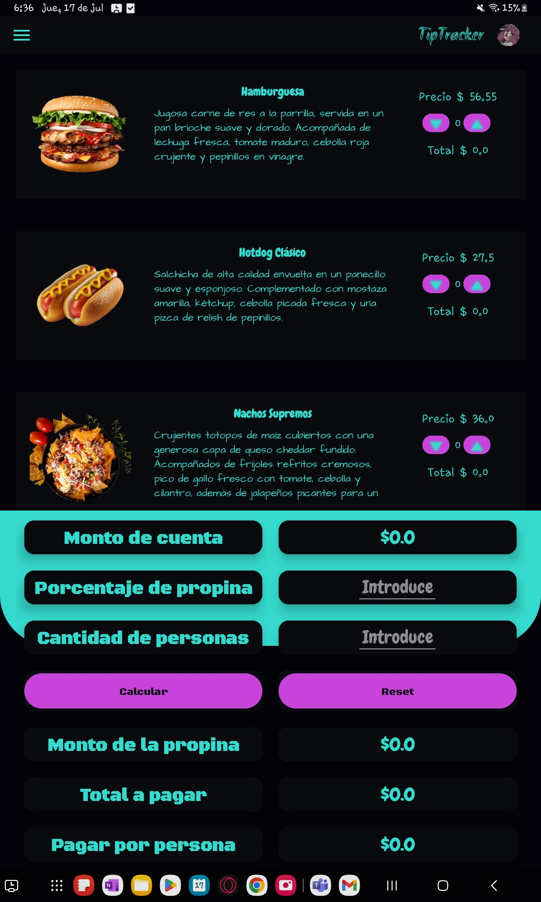
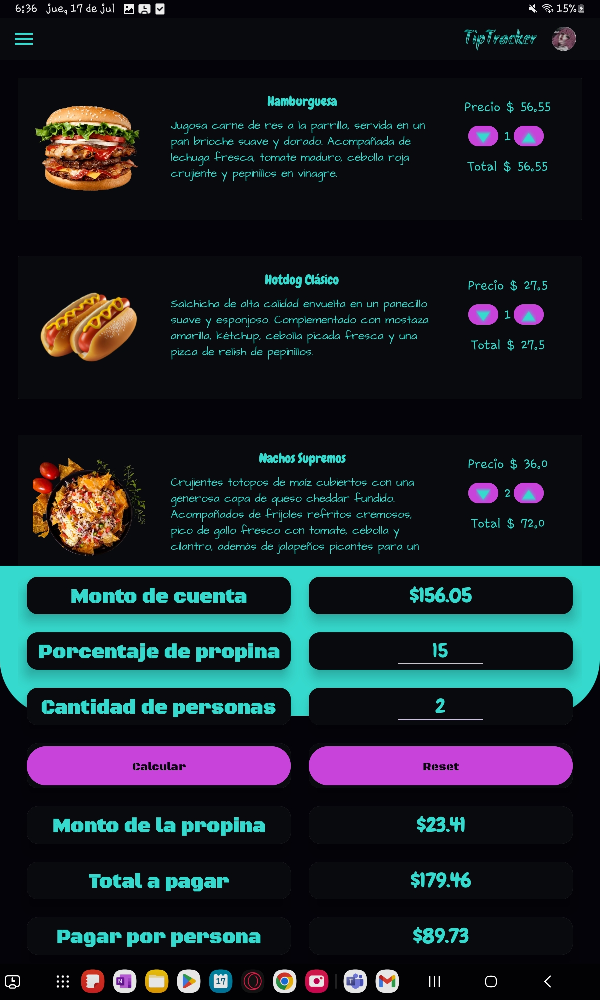

<h1 align="center">🍽️ TipTracker</h1>
<p align="center">
  <em>A smart tip calculator for restaurants, built with Kotlin & Firebase</em>
</p>

<p align="center">
  
  
  
  
</p>

---

## 🌟 About TipTracker

**TipTracker** is a mobile application designed for restaurants to calculate tips easily and quickly.  
With an intuitive interface, users can **select menu items, calculate tips, and split the bill among multiple people**.

---

## ✨ Features

✔ **Dynamic Menu** – Horizontal scrollable menu with product details  
✔ **Automatic Total Update** – Real-time update of subtotal as items are added  
✔ **Tip Calculation** – Enter desired tip percentage and number of people  
✔ **Detailed Results** – Displays:
- Tip amount  
- Total amount (bill + tip)  
- Amount each person should pay  

✔ **Reset Button** – Start a new calculation instantly  

---

## 📸 Screenshots

_Add your three screenshots in the `images` folder as shown below:_  

| Home Screen | Menu Selection | Tip Calculation |
|-------------|---------------|-----------------|
|  |  |  |

---

## 🛠 Tech Stack

- **Platform:** Android  
- **Language:** Kotlin  
- **Database:** Firebase Firestore  
- **Other:** Material Design Components  

---

## 🚀 Getting Started

### ✅ Installation
```bash
git clone https://github.com/your-username/tiptracker.git
cd tiptracker
# Open in Android Studio and build
